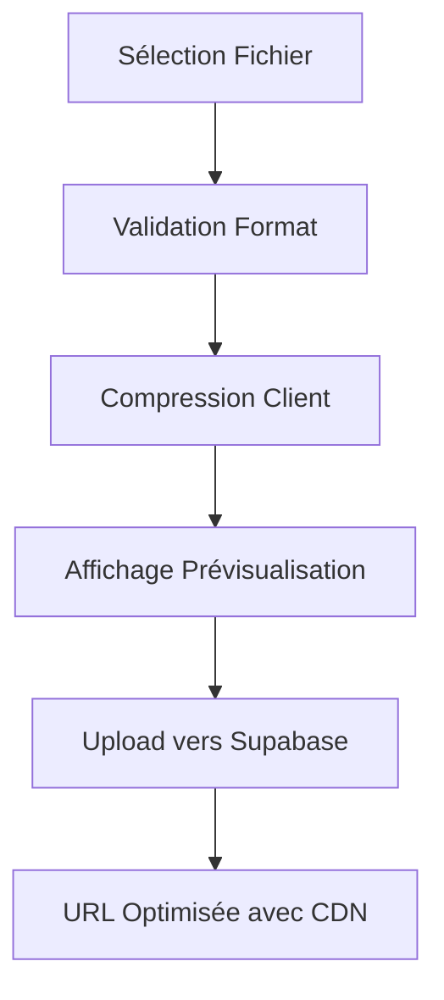

# Système d'Optimisation et Cache d'Images

Ce document décrit le nouveau système d'optimisation et de cache d'images implémenté pour résoudre les problèmes de pixellisation en production.

## 🎯 Problèmes Résolus

1. **Images pixellisées en production** - Les images sont maintenant compressées côté client avec une qualité optimale
2. **Performance de chargement** - Système de cache intelligent avec Supabase CDN + Next.js
3. **Taille des uploads** - Réduction significative de la bande passante

## 🔧 Composants Implémentés

### 1. Service de Compression (`lib/services/image-compression.ts`)

#### Fonctionnalités
- **Compression côté client** avec `browser-image-compression`
- **Qualité préservée** (90-95% selon le type d'image)
- **Traitement asynchrone** pour ne pas bloquer l'UI
- **Validation automatique** des formats et tailles

#### Configuration
```typescript
// Image principale - qualité maximale
MAIN_IMAGE_COMPRESSION_OPTIONS = {
  maxSizeMB: 3,
  maxWidthOrHeight: 2560,
  quality: 0.95, // 95%
  fileType: 'image/jpeg'
}

// Images supplémentaires - bonne qualité
DEFAULT_COMPRESSION_OPTIONS = {
  maxSizeMB: 2,
  maxWidthOrHeight: 2048,
  quality: 0.90, // 90%
  fileType: 'image/jpeg'
}
```

### 2. Service de Cache (`lib/services/image-cache.ts`)

#### Fonctionnalités
- **URLs optimisées** avec paramètres Supabase CDN
- **Cache en mémoire** pour éviter les recalculs
- **Images responsives** avec multiples résolutions
- **Préchargement intelligent** des images critiques

#### Utilisation
```typescript
// URL optimisée simple
const optimizedUrl = getOptimizedImageUrl(originalUrl, {
  width: 600,
  height: 600,
  quality: 85,
  format: 'webp'
})

// URLs responsives complètes
const urls = getResponsiveImageUrls(originalUrl)
// { thumbnail, small, medium, large, original }
```

### 3. Composant Image Optimisé (`components/ui/optimized-image.tsx`)

#### Fonctionnalités
- **Remplacement direct** de `next/image`
- **Chargement progressif** avec skeleton
- **Gestion d'erreurs** avec fallback
- **Types spécialisés** (Avatar, Cover)

#### Utilisation
```tsx
// Image basique
<OptimizedImage
  src={imageUrl}
  alt="Description"
  width={400}
  height={400}
  cacheWidth={600}
  cacheQuality={85}
/>

// Avatar optimisé
<OptimizedAvatar
  src={avatarUrl}
  alt="Photo profil"
  size={40}
/>

// Image de couverture
<OptimizedCoverImage
  src={coverUrl}
  alt="Couverture"
  aspectRatio="16/9"
/>
```

## 🚀 Intégration dans les Composants

### Composants Mis à Jour

1. **`use-model-images.ts`** - Upload avec compression pour nouveau modèle
2. **`use-image-management.ts`** - Upload avec compression pour édition
3. **`use-image-groups.ts`** - Upload avec compression pour groupes d'images
4. **`model-main-image.tsx`** - Affichage optimisé avec cache
5. **`model-card.tsx`** - Cartes de modèles avec images optimisées

### Workflow d'Upload



## 📊 Améliorations de Performance

### Compression
- **Réduction moyenne** : 60-80% de la taille originale
- **Qualité préservée** : 90-95% selon le type d'image
- **Formats supportés** : JPEG, PNG, WebP, GIF

### Cache
- **URLs en cache** : Évite les recalculs répétés
- **Préchargement** : Images critiques chargées en priorité
- **Responsive** : Tailles multiples générées automatiquement

### Next.js Integration
- **Remote Patterns** : Configuration Supabase optimisée
- **Image Optimization** : Compression serveur complémentaire
- **Lazy Loading** : Chargement différé par défaut

## 🔍 Logs et Monitoring

### Compression
```javascript
// Console logs automatiques
"Compression de l'image: photo.jpg"
"Taille originale: 5.2MB"
"Taille compressée: 1.8MB"
"Réduction: 65.4%"
```

### Notifications Utilisateur
- ✅ Compression réussie avec pourcentage
- ⚠️ Erreurs de validation détaillées
- 📊 Informations de traitement groupé

## 🛠 Configuration Avancée

### Variables d'Environnement
```env
# Déjà configuré dans next.config.js
NEXT_PUBLIC_SUPABASE_URL=your-project-url
NEXT_PUBLIC_SUPABASE_ANON_KEY=your-anon-key
```

### Limites de Taille
- **Avant compression** : 50MB maximum
- **Après compression** : 2-3MB selon le type
- **Résolution max** : 2560px (image principale), 2048px (autres)

## 🚨 Points d'Attention

### Compatibilité
- **Navigateurs modernes** requis pour `browser-image-compression`
- **Web Workers** utilisés pour ne pas bloquer l'UI
- **Fallback** sur fichier original en cas d'erreur

### Performance
- **Traitement parallèle** pour uploads multiples
- **Cache intelligent** pour éviter les re-compressions
- **Nettoyage automatique** des URLs blob

## 📈 Résultats Attendus

1. **Qualité d'image préservée** en production
2. **Temps de chargement réduits** grâce au cache
3. **Bande passante économisée** avec la compression
4. **Expérience utilisateur améliorée** avec le feedback visuel

---

*Ce système est maintenant entièrement intégré et fonctionnel. Tous les uploads d'images utilisent automatiquement la compression et le cache optimisé.* 